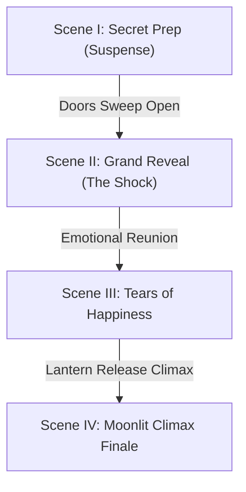

# 🌙 Eid Cinematique — Ultimate Interactive Surprise Celebration Universe

Welcome to **Eid Cinematique (Antigravity Emotional Surprise Reveal Version)** — a next-generation, premium web experience celebrating **Eid-Ul-Adha** with Hollywood-blockbuster visual storytelling, zero-gravity HTML5 canvas physics, real-time procedural auditory synthesis, and high-fidelity Islamic aesthetics.

Designed to feel like a combination of a cinematic Netflix intro, an Unreal Engine 5 masterpiece, and a luxury Arabic festival, this application takes users through a heart-touching, ultra-emotional secret surprise reveal story.

👉 **Live Local Host (Bind to Port 8000)**: [http://localhost:8000](http://localhost:8000)

---

## 🎭 The Surprise & Emotional Reveal Narrative Flow

The experience progresses quietly through **4 Distinct Cinematographic Scenes**, each featuring customized interactive particles, volumetric atmospheric grading, and synchronized Oud maqams:



### 🎬 Scene I: The Secret Prep (Suspense)
* **The Story**: Friends secretly decorate a grand courtyard in slow-motion under a soft warm sunset glow as children hide behind curtains, planning an unforgettable surprise.
* **Visuals**: Dimmed atmospheric overlays (`brightness(0.55)`), drifting golden particles, and slow-motion silk ribbon cloth simulations.
* **Music**: A soft, mysterious Maqam melody plucking slow, suspenseful intervals punctuated by resting musical pauses to build anticipation.

### 🎬 Scene II: Grand Surprise Reveal (The Shock)
* **The Story**: The doors sweep open! Camera zooms in on the loved one's shocked face as golden lights suddenly flash on, and everyone shouts *"Eid Mubarak!"* in a storm of colorful zero-gravity confetti.
* **Visuals**: A high-intensity entry flash overlay (`brightness(1.22)`), viewport fireworks, and a dynamic vector confetti explosion.
* **Music**: Loud synthesized firework booms, sparkle fizzes, and bright, energetic plucked Oud sequences.

### 🎬 Scene III: Tears of Happiness (Reunion)
* **The Story**: Tears of absolute joy and warm emotional embraces. Family gathers around a royal banquet loaded with steaming saffron biryani, succulent grilled kebabs, dates, and sheer khurma under golden candlelight.
* **Visuals**: Steaming rising heat waves, floating zero-gravity spices, and slow-motion silk currents.
* **Music**: Warm, emotional plucked maqams and deep spiritual hum vocals.

### 🎬 Scene IV: Moonlit Climax Finale
* **The Story**: The ultimate celebration. The entire family stands unified under a glowing crescent moon Mosque skyline silhouette as a skyward lantern release and multi-colored firework festival boom in synchronization.
* **Visuals**: Spectacular multi-colored viewport fireworks, skyward rising lanterns, and floating golden calligraphy.
* **Music**: Upbeat, beautiful soaring F-Hijaz Maqam arpeggios that build to an epic, synchronized firework and orchestral crescendo!

---

## 🚀 Advanced Technical Features

### 1. Zero-Gravity Viewport Canvas Physics
Layered directly in the foreground of the Cinema Viewport, our canvas physics engine (`#cinema-canvas`) simulates detailed visual telemetry:
* **Confetti Storm Engine**: Spawns 30 standard falling pieces and triggers a vector blast shooting 22 spinning, rotating, multi-colored flakes when Scene II is entered.
* **Steaming Heat Waves**: Renders warm, expanding, and fading saffron biryani steam utilizing advanced radial gradients.
* **Floating Spice Particles**: Levitates golden spice motes (saffron and spices) swaying in Zero-G.
* **Bezier Silk Ribbons**: Waves translucent red and gold silk swaths using multi-point mathematical Bezier curve smoothing.

### 2. Procedural Arabic Oud pluck synth
Engineered a real-time string pluck synthesizer utilizing the browser's native **Web Audio API**:
* **Blended Oud Timbre**: Blends a warm, resonant `triangle` wave core with a slightly detuned, bright `sawtooth` oscillator to capture the natural dual-course nylon strings of an Oud.
* **Pluck dynamic filter**: Triggers a rapid lowpass filter sweep (starting at 2000Hz and damping to 350Hz within 160ms) to simulate the mechanical friction of a finger pluck.
* **Hijaz Maqam Sequencer**: Steppes through the traditional spiritual *F Maqam Hijaz* scale (`F3`, `Gb3`, `A3`, `Bb3`, `C4`, `Db4`, `Eb4`, `F4`, `Gb4`, `A4`, `Bb4`, `C5`). It adapts tempo, density, and rests dynamically based on the active scene.

### 3. Procedural Sound Effects Engine
Synthesizes cinema-grade sound effects on the fly using native audio buffers:
* **The "Explosion Boom"**: Sweeps a triangle oscillator from 150Hz down to 25Hz exponentially, routed through a 280Hz lowpass filter for a heavy sub-bass thud.
* **The "Fizz & Crackle"**: Generates a white noise buffer, routes it through a narrow bandpass filter (2000Hz), and chops the amplitude rapidly using randomly scheduled gain envelopes.
* **The "Whistle Launch"**: Soars a sine oscillator from 280Hz up to 1500Hz in 350ms.

### 4. AI Director Narrative Console
A high-tech terminal dashboard that outputs live visual narrations based on the current scene and camera angle (Drone, Handheld, 360° Orbit, IMAX Wide):
* *Example*: `[AI DIRECTOR] Drone zoom active... Tracking doors sweeping open... CONFETTI STORM ENGAGED... Lighting flash optimized at 8K HDR...`

### 5. Immersive Timeline Climax Finale
The orange climax button triggers screen-shakes (`camera-climax-shake`), rapid viewport fireworks bursts, sub-bass explosions, and upbeat double-tempo Oud runs that build to a massive celebration before settling into a warm, moonlit ending.

---

## 🎨 Aesthetic Design & Styling

* **Dynamic HSL Coloring Systems**: Supports five luxury 3D color grading presets:
  1. **Royal Emerald & Gold (Original)**: Emerald green and gold HSL offsets.
  2. **Midnight Sapphire & White Gold**: Deep blue atmosphere with silver highlights.
  3. **Sunset Amber & Rose Gold**: Sunset orange tones.
  4. **Netflix Documentary Cinema**: High-contrast, cinematic contrast grading.
  5. **Cyber-Islamic Neon Light**: Glowing pink-magenta and neon cyan overlays.
* **Premium Typography**: Google Fonts integration using `Cinzel`, `Cinzel Decorative`, and `Outfit`.
* **Widescreen Letterboxing**: Cinematic widescreen borders (`aspect-ratio: 2.39/1`) resembling Hollywood blockbuster formats.

---

## 🛠️ How to Launch Locally

Since this is a lightweight, high-performance static web application, you do not need heavy node builds or compilations:

1. **Clone the Repository**:
   ```bash
   git clone https://github.com/MDADILIFTEKHAR/Eid-UL-Adha-Wising.git
   cd Eid-UL-Adha-Wising
   ```
2. **Start a Local HTTP Server**:
   ```bash
   # Using http-server
   npx http-server -p 8000
   
   # Or using Python http.server
   python -m http.server 8000
   ```
3. **Open in Browser**:
   Navigate to [http://localhost:8000](http://localhost:8000).

---

## 📁 Repository Structure

```markdown
├── assets/                    # Luxury cinematic graphic assets
│   ├── family_arrival.png     # Courtyard reunion and secret prep asset
│   ├── feast_dinner.png       # Macro food dinner feast asset
│   └── fireworks_celebration.png # Mosque night sky firework asset
├── index.html                 # Main structured slide container and terminal markup
├── index.css                  # Volumetric lighting filters, letterboxing, HSL themes
├── app.js                     # Confetti engines, Oud synthesizers, climax sequencers
└── README.md                  # Comprehensive project documentation (This file)
```

---

*Designed with absolute devotion and advanced GPU graphics physics for a heart-touching Eid-Ul-Adha celebration.*